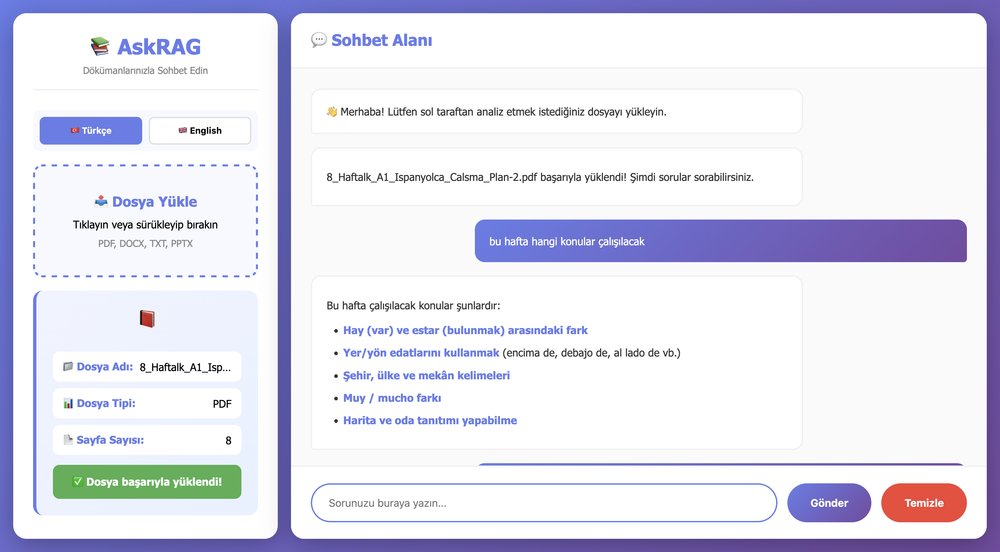
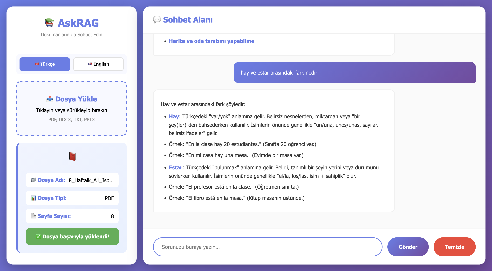

# 📚 ASKRAG - AI-Powered Document Chatbot

ASKRAG is an intelligent RAG (Retrieval Augmented Generation) based chatbot that enables users to chat with their documents. Built with Google Gemini API and modern web technologies, it provides accurate answers from uploaded PDF, DOCX, TXT, and PPTX files.

This project was developed as part of the **Akbank GenAI Bootcamp** to demonstrate practical implementation of RAG architecture for document analysis and question-answering systems.

## 📷 Proje Ekran Görüntüleri

### 1. Ana Ekran ve Yükleme Arayüzü


### 2. Sohbet ve Cevap Örneği


## 🎯 Project Purpose

ASKRAG solves the challenge of quickly extracting information from lengthy documents. Instead of manually searching through pages, users can:
- Upload documents in various formats
- Ask questions in natural language
- Get accurate, context-aware answers
- Interact in both Turkish and English

## 🌟 Features

- **Multi-Format Support**: PDF, DOCX, TXT, PPTX
- **Bilingual Interface**: Full Turkish and English support
- **Smart Responses**: Formatted answers with headings, lists, and code blocks
- **Conversational Memory**: Maintains chat history for contextual follow-ups
- **Modern UI**: Clean, responsive design for desktop and mobile
- **Secure Processing**: Files are processed and deleted immediately after embedding

## 🏗️ Architecture

### RAG Pipeline Components:

1. **Document Processing**
   - Extracts text from multiple file formats (PyPDF2, python-docx, python-pptx)
   - Chunks text into manageable segments (RecursiveCharacterTextSplitter)
   - Preserves metadata (file type, page count)

2. **Vector Embedding**
   - Uses Sentence Transformers (`all-MiniLM-L6-v2`)
   - Converts text chunks into semantic vectors
   - Stores in Chroma vector database

3. **Retrieval & Generation**
   - Retrieves relevant context using similarity search
   - Google Gemini 2.5 Flash generates responses
   - LangChain ConversationalRetrievalChain manages the pipeline

### Technology Stack:

**Backend:**
- Python 3.10+
- Flask (Web Framework)
- LangChain (RAG Pipeline)
- Google Gemini API (LLM)
- Chroma (Vector Database)
- HuggingFace Transformers (Embeddings)

**Frontend:**
- HTML5, CSS3, JavaScript
- Responsive Design
- Modern gradient UI

## 📦 Dataset Information

This application does not use a pre-prepared dataset. Instead:
- Users upload their own documents
- Each document is processed in real-time
- Text is extracted, chunked, and embedded on-the-fly
- Vector database is created per session
- No documents are stored permanently (privacy-focused)

## 🚀 Deployment

**Live Demo:** [ASKRAG on Render](https://your-app-name.onrender.com)

The application is deployed on Render's free tier, providing:
- 24/7 availability
- Automatic HTTPS
- GitHub integration for CI/CD

## 💻 Local Installation

### Prerequisites
- Python 3.10 or higher
- Google Gemini API key ([Get it here](https://ai.google.dev/))

### Step-by-Step Guide

1. **Clone the repository:**
```bash
git clone https://github.com/r00trose/akbank-genai-rag-chatbot.git
cd akbank-genai-rag-chatbot
```

2. **Create virtual environment:**
```bash
python -m venv venv

# Activate on Windows:
venv\Scripts\activate

# Activate on Mac/Linux:
source venv/bin/activate
```

3. **Install dependencies:**
```bash
pip install -r requirements.txt
```

4. **Set up environment variables:**

Create a `.env` file in the project root:
```env
GOOGLE_API_KEY=your_gemini_api_key_here
```

5. **Run the application:**
```bash
python app.py
```

6. **Open in browser:**
```
http://localhost:5001
```

## 📖 Usage Guide

### Step 1: Upload Document
- Click the upload area on the left panel
- Select a PDF, DOCX, TXT, or PPTX file
- Wait for processing (a few seconds)

### Step 2: Ask Questions
- Type your question in the input box
- Press Enter or click "Gönder"
- Receive formatted, contextual answers

### Step 3: Language Selection
- Switch between Turkish (🇹🇷) and English (🇬🇧)
- All UI elements and responses adapt to selected language

### Step 4: Clear History
- Click "Temizle" to start a new conversation
- Upload a new document if needed

## 📁 Project Structure

```
akbank-genai-rag-chatbot/
├── app.py                      # Flask application & routes
├── rag_pipeline.py             # RAG logic & LLM integration
├── document_processor.py       # File parsing & text extraction
├── requirements.txt            # Python dependencies
├── .env                        # Environment variables (not in repo)
├── .gitignore                 # Git ignore rules
├── templates/
│   └── index.html             # Main web interface
├── static/
│   └── uploads/               # Temporary file storage
└── chroma_db/                 # Vector database (gitignored)
```

## 🔧 Configuration

### Key Files:

**`app.py`:**
- Flask routes (`/upload`, `/ask`, `/clear`)
- File handling & session management
- Error handling

**`rag_pipeline.py`:**
- Vector store creation
- Question answering logic
- Conversation memory management

**`document_processor.py`:**
- Text extraction from various formats
- Text chunking strategies
- Metadata handling

## 🎓 Bootcamp Project Requirements

This project fulfills all Akbank GenAI Bootcamp requirements:

✅ **GitHub Repository** - Clean, organized code  
✅ **README.md** - Comprehensive documentation  
✅ **RAG Implementation** - Full pipeline with LangChain  
✅ **Web Interface** - Modern, responsive UI  
✅ **Multi-format Support** - PDF, DOCX, TXT, PPTX  
✅ **Deployment** - Live on Render  
✅ **Bilingual** - Turkish & English support  

## 🐛 Troubleshooting

**Issue:** Module not found errors  
**Solution:** Reinstall requirements: `pip install -r requirements.txt`

**Issue:** API key error  
**Solution:** Check `.env` file has correct `GOOGLE_API_KEY`

**Issue:** Chroma database errors  
**Solution:** Delete `chroma_db/` folder and restart

## 📝 License

This project is developed for educational purposes as part of Akbank GenAI Bootcamp.

## 🤝 Contributing

Contributions, issues, and feature requests are welcome!

## 👨‍💻 Contact

**GitHub:** [@r00trose](https://github.com/r00trose)  
**Project Link:** [akbank-genai-rag-chatbot](https://github.com/r00trose/akbank-genai-rag-chatbot)

---

**Made with ❤️ for Akbank GenAI Bootcamp**
